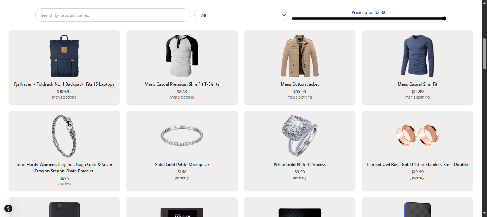

# 🛍️ Modern E-Commerce Website  

A fully responsive e-commerce website built using **Next.js**, **TypeScript**, and **Tailwind CSS**.  
It includes user authentication (Sign In / Sign Up), product listing from APIs, category filtering, and a dynamic shopping cart.

---

## 🚀 Features  

✅ Modern, clean, and responsive UI  
✅ Sign Up & Sign In (with LocalStorage authentication)  
✅ Product fetching from multiple APIs  
✅ Search products by **name, price, and category**  
✅ Mobile-friendly navigation menu  
✅ Logout option (clears session and redirects to Sign In page)

---

## 🖼️ Screenshots  

### 🏠 Home Page  


### 🔐 Sign In / Sign Up Page  


### 🛒 Product Page  


> 📸 *Make sure to create a folder named `/screenshots` in your project and save the screenshots as shown above.*

---

## 🧩 Technologies Used  

- **Next.js 14**
- **React**
- **TypeScript**
- **Tailwind CSS**

---

## ⚙️ How to Run Locally  

Follow these steps to run the project on your system 👇  

### 1️⃣ Clone the Repository  
```bash
git clone https://github.com/your-username/your-repo-name.git
